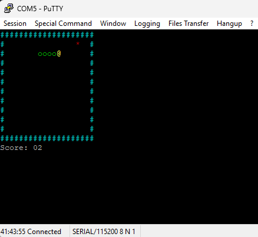

# 🐍 Snake_4mon

Un clásico juego de Snake implementado en **C89 estricto** para el procesador **6502** corriendo sobre el monitor para FPGA Tang Nano 9K, con efectos de sonido generados por el chip **SID 6581**. Diseñado para ejecutarse en la FPGA **Tang Nano 9K** con monitor ROM personalizado.



## ✨ Características

- 🎵 **Audio SID 6581 polifónico**: Jingle de introducción, efectos al comer y melodía de Game Over usando 2 voces simultáneas
- 🎨 **Colores ANSI vibrantes**: Paredes cyan, cabeza amarilla, cuerpo verde, comida roja en terminal
- 🎮 **Controles intuitivos**: WASD o flechas ANSI para movimiento fluido
- ♻️ **Menú de reinicio integrado**: Presiona `P` para jugar de nuevo o `E` para salir al monitor
- ⚡ **Optimizado para 6502**: Código eficiente en C89 estricto compatible con CC65, ~720B de RAM usada
- 📊 **Puntuación en tiempo real**: Score visible durante la partida y al finalizar

## 🛠️ Especificaciones Técnicas

### Hardware Objetivo
- **CPU**: MOS 6502 @ 1MHz
- **Audio**: SID 6581 mapeado en `$D400-$D41F`
- **Plataforma**: Tang Nano 9K FPGA con Monitor 6502 v2.2.0+
- **Display**: Terminal serie compatible con códigos ANSI

### Software
- **Compilador**: CC65 (`cl65`)
- **Lenguaje**: C89 estricto (ANSI C) + ensamblador para startup
- **Dependencias**: `romapi.h` (Jump Table en `$BF00` del monitor ROM)

## 📋 Requisitos

### Para Compilar
- [CC65](https://cc65.github.io/) compilador cruzado para 6502 instalado
- Make (en Windows: incluido con Git Bash, WSL o Make for Windows)
- Ruta de CC65 configurada en el `makefile`

### Para Ejecutar
- Tang Nano 9K con bitstream del Monitor 6502 v2.2.0+ cargado
- Terminal compatible con ANSI escape codes (PuTTY, TeraTerm, Linux console, macOS Terminal)
- Conexión serial configurada (115200 baudios recomendado)
- SD Card formateada en FAT16/32 (opcional, también soporta XMODEM)

## 🚀 Instalación y Compilación

1. **Clonar el repositorio**:
```bash
git clone https://github.com/nelsama/Snake_4mon.git
cd Snake_4mon